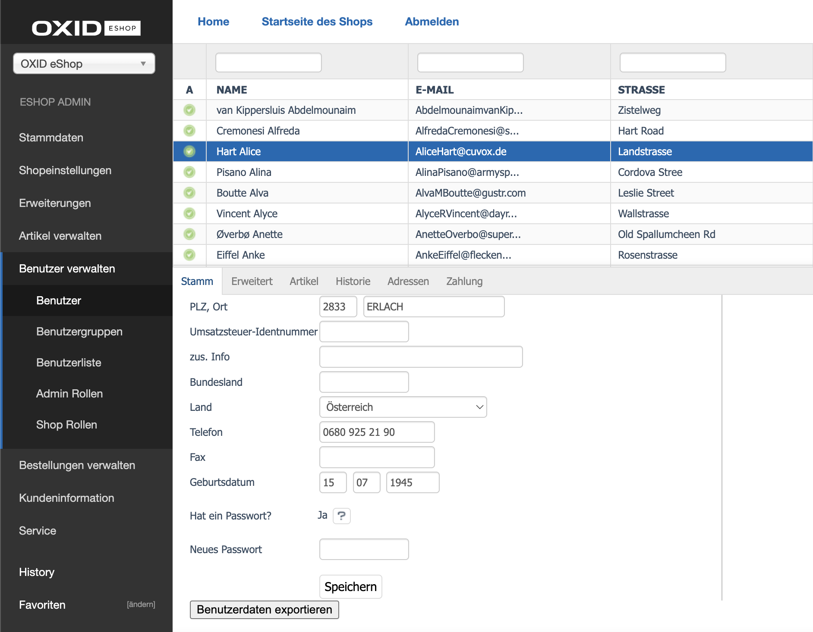

================
User Data Export
================

Overview
========

The **User Data Export** feature in the OXID eShop GDPR module allows administrators to export all data related to a specific user in compliance with GDPR regulations. This exported data includes personal information and any associated records such as orders, vouchers, and user activities within the shop.

How to Export User Data
=======================

To export the data of a user from OXID eShop, follow these steps:

1. **Log in to the Admin Panel** of OXID eShop.

2. Navigate to the **Administer Users** section.

   - Use the search or scroll feature to locate the user for whom you want to export data.

3. **Select the user** to open their detailed information view.

4. In the user's details, you will find a button labeled **"Export User Data"** (or a similar name) located inside the **Main Tab**.

5. **Click the "Export User Data" button**.

   - The system will process the request and generate a ZIP file containing all available data associated with the user.

6. Once the export process is complete, a **ZIP file will be downloaded** via the browser. This file contains all relevant data for the user in a structured format.

7. After the download, the system triggers a **background cleanup process**. The temporary ZIP file on the server is automatically removed to ensure the server remains optimized and clutter-free.
