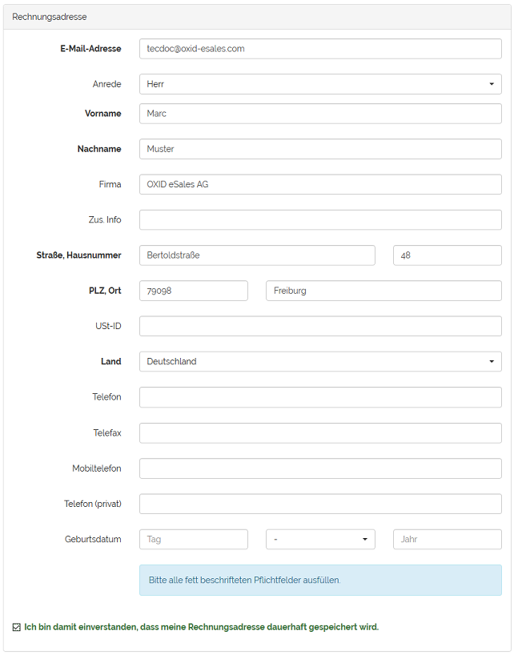
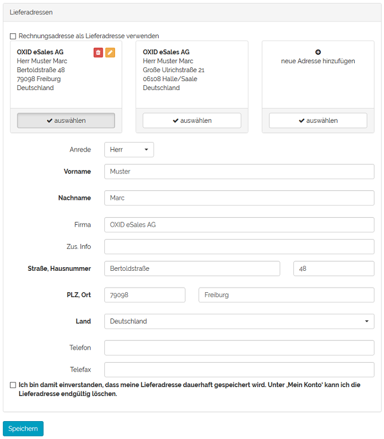
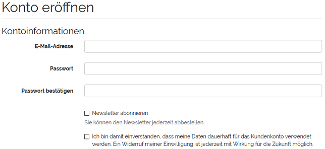
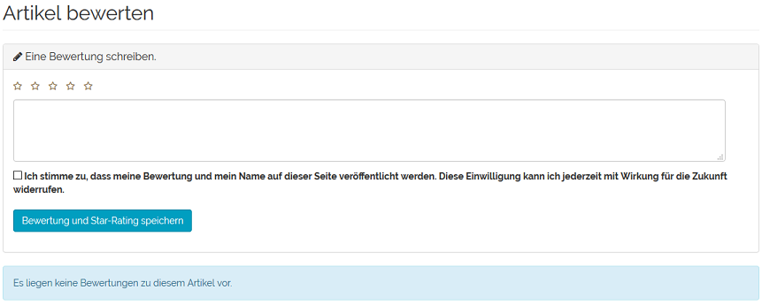
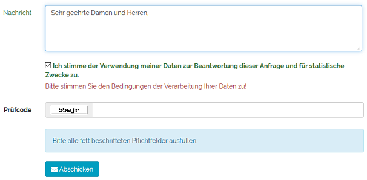

Funktionen
==========

Die Funktionen, die das Modul GDPR Opt-in bereitstellt, nuten Ihre Kunden im Frontend Ihres OXID eShops.

Sie fordern von Kunden die ausdrückliche Zustimmung zur Speicherung und Verarbeitung ihrer Daten beim Ändern der Rechnungsadresse, dem Anlegen von Lieferadressen, bei der Registrierung im Shop, bei der Bewertung von Artikeln und beim Abschicken von Anfragen über das Kontaktformular.

Die Opt-ins werden erst angezeigt, wenn der Kunde am Shop angemeldet ist. Einzige Ausnahme davon ist die Registrierung.

Opt-in Rechnungsadresse aktivieren
----------------------------------

Unter :menuselection:`Mein Konto --> Rechnungs- und Liefereinstellungen` können die Rechnungsadresse sowie alle vorhandenen Lieferadressen eines Kunden eingesehen und bearbeitet werden.

Wurde die Moduleinstellung :guilabel:`Opt-in für Rechnungsadresse anzeigen` aktiviert, muss der Kunde explizit zustimmen, wenn er die Rechnungsadresse geändert hat und diese speichern will. Das Kontrollkästchen für das Opt-in muss dafür angehakt werden.

-----------------------------------------------------------------------------------------

Opt-in Lieferadressen aktivieren
--------------------------------
Unter :menuselection:`Mein Konto --> Rechnungs- und Liefereinstellungen` werden alle vorhandenen Lieferadressen eines Kunden aufgelistet, wenn das Kontrollkästchen Rechnungsadresse als Lieferadresse verwenden nicht angehakt ist. Hier kann eine vorhandene Lieferadresse bearbeitet oder eine neue hinzugefügt werden.

Wurde die Moduleinstellung :guilabel:`Opt-in für Lieferadresse anzeigen` aktiviert, ist die explizite Zustimmung des Kunden notwendig, damit die Lieferadresse gespeichert werden kann.

Das Bearbeiten und Hinzufügen von Lieferadressen ist auch direkt im Bestellprozess möglich.

-----------------------------------------------------------------------------------------

Opt-in Registrierung aktivieren
-------------------------------

Ein Kunde kann sich im Shop registrieren, indem er im Frontend den Link :guilabel:`Anmelden` klickt und dann auf :guilabel:`Registrieren` wechselt. Er kann aber auch im Bestellschritt zwei ein Konto im Shop eröffnen.

Wurde die entsprechende Moduleinstellung aktiviert, kann die Registrierung nur abgeschlossen werden, wenn der dauerhaften Verwendung der im Formular angegebenen Daten für das Kundenkonto explizit zugestimmt wurde.

-----------------------------------------------------------------------------------------

Opt-in Bewertung aktivieren
---------------------------
Kunden können eine Bewertung zu einem Artikel schreiben und für diesen maximal fünf Sterne vergeben. Ist die Moduleinstellung :guilabel:`Opt-in für Artikelbewertungen anzeigen` aktiviert, wird ein Hinweis darauf eingeblendet, dass die Bewertung und der Name des Kunden auf der Detailseite des Artikels angezeigt werden. Ohne die ausdrückliche Zustimmung durch Anhaken des Kontrollkästchens können die Bewertung und das Sterne-Rating nicht gespeichert werden.

-----------------------------------------------------------------------------------------

Opt-in Kontaktformular aktivieren
---------------------------------
Für das Kontaktformular kann festgelegt werden, dass die Daten der Anfrage für deren Beantwortung und für statistische Zwecke verwendet werden.

Der Kunde muss den Bedingungen der Verarbeitung seiner Daten explizit zustimmen.

Alternativ dazu können auch alle übermittelten Daten direkt nach der Verarbeitung gelöscht werden. Wurde diese Moduleinstellung gewählt, wird dem Kunden ein entsprechender Hinweis angezeigt.

Benutzerdaten GDPR-konform exportieren
--------------------------------------

Exportieren Sie als Administrator alle Daten, die mit einem bestimmten Benutzer in Verbindung stehen, gemäß den GDPR-Vorschriften.

Diese exportierten Daten umfassen persönliche Informationen sowie alle zugehörigen Aufzeichnungen wie Bestellungen, Gutscheine und Benutzeraktivitäten im Shop.

.. todo: klären: welches strukturierte Format?

|procedure|

1. Melden Sie sich im Admin-Panel des OXID eShop an.
#. Navigieren Sie zum Bereich :guilabel:`Benutzer verwalten`.
#. Wählen Sie den Benutzer.

   Sie gelangen in die detaillierte Informationsansicht.

#. Wählen Sie auf der Registerkarte :guilabel:`Stamm` die Schaltfläche :guilabel:`Benutzerdaten exportieren`.

   .. figure:: media/screenshots/oxdajj06.png
      :alt: Benutzerdaten exportieren
      :width: 650
      :class: with-shadow

      Abb.: Benutzerdaten exportieren

   Das System generiert eine ZIP-Datei, die alle verfügbaren Daten des Benutzers enthält, und lädt sie über den Browser herunter.

   Nach dem Download wird die temporäre ZIP-Datei auf dem Server automatisch entfernt, um sicherzustellen, dass der Server optimiert und aufgeräumt bleibt.

.. Intern: oxdajj, Status: