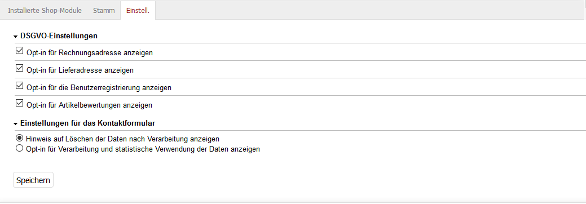

Konfiguration
=============

Die Funktionen des Moduls lassen sich in dessen Einstellungen aktivieren bzw. deaktivieren. Gehen Sie dafür im Administrationsbereich zu :menuselection:`Erweiterungen --> Module` und wählen Sie das Modul GDPR Opt-in aus der Liste der Module. Sie finden die Einstellungen auf der Registerkarte :guilabel:`Einstell.`

DSGVO-Einstellungen
   Hier kann eingestellt werden, ob für das Ändern der Rechnungsadresse, das Anlegen einer Lieferadresse, für die Registrierung im Shop und für die Bewertung von Artikeln die ausdrückliche Zustimmung des Kunden zur Speicherung und Verarbeitung seiner personenbezogenen Daten eingeholt werden muss. Ist die Einstellung aktiviert, wird dadurch im Frontend bei der Funktion ein entsprechender Hinweis angezeigt, den der Kunde zur Kenntnis nehmen muss und dem er durch das Anhaken eines Kontrollkästchens explizit zustimmt.

Einstellungen für das Kontaktformular
   Für das Kontaktformular kann zwischen zwei Optionen gewählt werden. Zum einen kann ein Hinweis angezeigt werden, dass alle durch die Anfrage übergebenen Daten nach ihrer Verarbeitung gelöscht werden. Zum anderen werden die Daten gespeichert und der Kunde muss dem explizit zustimmen.

.. Intern: oxdaji, Status: